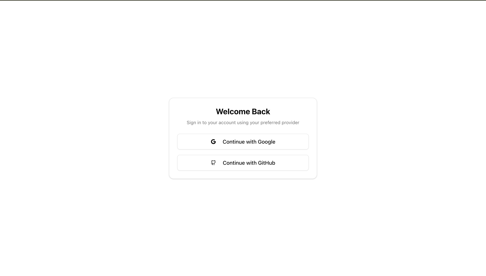
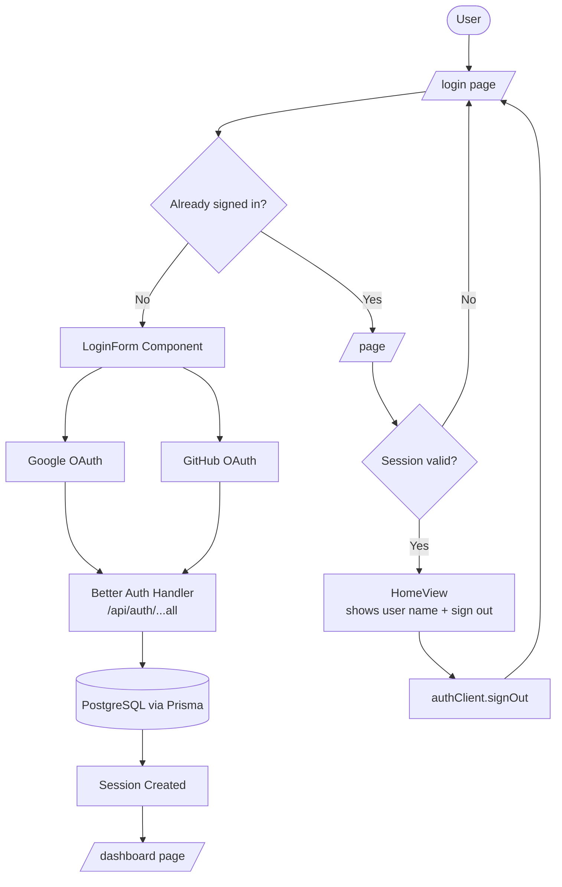

# 🔐 Authentication App
A clean, full-stack authentication application built with Next.js 16 and Better Auth. Sign in with Google or GitHub using OAuth — powered by Prisma, PostgreSQL, and a modern session-based architecture for a secure, seamless experience.

> Visit [Auth App](https://better-auth-gmarav05.vercel.app/login)

`Next.js` `React` `Better Auth` `Prisma` `PostgreSQL` `Shadcn UI` `Tailwind CSS`

---

## 📋 Overview

Authentication App is a production-ready auth boilerplate that demonstrates a modern **Better Auth + Prisma + Next.js App Router** architecture. Users can sign in with Google or GitHub, and are redirected based on their session state — all with server-side session validation and clean client-side state management.

A natural starting point for any full-stack project that needs reliable, extensible authentication out of the box.

---


## Live Demo


https://github.com/user-attachments/assets/5cc6279c-3c4b-4fd6-a1a7-636f52b89aca


## Screenshot 

<div style="display: flex; justify-content: center; gap: 20px;">  
</div>


---

## 🌟 Features

### Core Functionality
- **Google OAuth** — Sign in with a Google account via OAuth 2.0.
- **GitHub OAuth** — Sign in with a GitHub account via OAuth 2.0.
- **Session Management** — Persistent, token-based sessions stored securely in PostgreSQL.
- **Protected Routes** — Server-side session checks redirect unauthenticated users to `/login`.
- **Sign Out** — One-click sign out that clears the session and redirects to the login page.

### Technical Features
- **Better Auth** — Handles all OAuth flows, session creation, and token management.
- **Prisma ORM** — Type-safe database access with a singleton client to prevent duplicate connections.
- **PostgreSQL** — Durable, relational session and user storage.
- **Shadcn UI** — Accessible, composable UI components (Card, Button, etc.).
- **Server Components** — Session is validated on the server before rendering any protected page.
- **React Compiler** — Enabled via `babel-plugin-react-compiler` for automatic memoization.

### UX Features
- **Instant Redirects** — Authenticated users skip the login page; unauthenticated users can't access the dashboard.
- **Responsive Design** — Mobile-first, centered layout that works on all screen sizes.
- **Dark Mode** — Full dark mode support via Shadcn's CSS variable theming system.

---

## 📚 Learnings
- Learned how **Better Auth** abstracts OAuth complexity — configuring providers, handling callbacks, and issuing sessions with minimal boilerplate.
- Understood how to validate sessions in **Next.js Server Components** using `auth.api.getSession()` with request headers before deciding to render or redirect.
- Practiced the **Prisma singleton pattern** — caching the client in `globalThis` to avoid connection pool exhaustion during hot reloads in development.
- Implemented **route protection** at the page level using `redirect()` from `next/navigation`, keeping auth logic co-located with the routes it protects.
- Explored how **Better Auth's client** (`createAuthClient`) provides reactive hooks like `useSession()` for real-time session state in Client Components.
- Practiced separating **server auth config** (`lib/auth.js`) from the **client auth instance** (`lib/auth-client.js`) to avoid accidentally leaking secrets to the browser.

---

## 🏗️ Application Architecture



---

## 💻 Technology Stack

| Category | Technologies |
|---|---|
| Frontend Framework | Next.js 16.1.6, React 19.2.3 |
| Language | JavaScript (JSX) |
| Authentication | Better Auth v1.4, better-auth/next-js |
| Database | PostgreSQL |
| ORM | Prisma 6.19 |
| UI Components | Shadcn UI (Radix UI primitives) |
| Styling | Tailwind CSS v4, PostCSS |
| Build Optimization | React Compiler (babel-plugin-react-compiler) |
| Fonts | Geist, Geist Mono via next/font |

---

## 📁 Project Structure

```
auth-app/
├── app/
│   ├── api/
│   │   └── auth/
│   │       └── [...all]/
│   │           └── route.js        # Better Auth catch-all handler (GET + POST)
│   ├── dashboard/
│   │   └── page.js                 # Protected dashboard page
│   ├── login/
│   │   └── page.js                 # Login page — redirects if session exists
│   ├── layout.js                   # Root layout — fonts + metadata
│   ├── page.js                     # Home — validates session, redirects if needed
│   └── globals.css                 # CSS variables, dark mode, Tailwind import
├── components/
│   ├── home.jsx                    # HomeView — shows user name + sign out button
│   ├── login-form.jsx              # Login card with Google & GitHub buttons
│   └── ui/                         # Shadcn UI component library
├── lib/
│   ├── auth.js                     # Better Auth server config (providers, adapter)
│   ├── auth-client.js              # Better Auth client instance (useSession, signOut)
│   ├── db.js                       # Prisma singleton connection
│   └── utils.js                    # cn() helper (clsx + tailwind-merge)
├── prisma/
│   └── schema.prisma               # User, Session, Account, Verification models
├── hooks/
│   └── use-mobile.js               # Responsive mobile detection hook
├── jsconfig.json                   # Path aliases (@/*)
├── next.config.mjs                 # Next.js config (React Compiler enabled)
├── components.json                 # Shadcn UI config
└── package.json                    # Dependencies
```

---

## 📊 Database Schema

```
User          — id, name, email, emailVerified, image, timestamps
Session       — id, token, expiresAt, userId (→ User), ipAddress, userAgent
Account       — id, providerId, accountId, userId (→ User), tokens, scope
Verification  — id, identifier, value, expiresAt, timestamps
```

---

## 🚀 Getting Started

### Prerequisites
- Node.js 18+
- A PostgreSQL connection string (local or hosted, e.g. Neon / Supabase)
- Google OAuth credentials (Client ID + Secret)
- GitHub OAuth credentials (Client ID + Secret)

### Installation

```bash
# Clone the repository
git clone https://github.com/yourusername/auth-app.git
cd auth-app

# Install dependencies
npm install
```

### Environment Variables

Create a `.env.local` file and add:

```env
DATABASE_URL=postgresql://<user>:<password>@<host>/<db>

BETTER_AUTH_SECRET=your_random_secret_here
BETTER_AUTH_URL=http://localhost:3000

GOOGLE_CLIENT_ID=your_google_client_id
GOOGLE_CLIENT_SECRET=your_google_client_secret

GITHUB_CLIENT_ID=your_github_client_id
GITHUB_CLIENT_SECRET=your_github_client_secret
```

### Database Setup

```bash
# Push the Prisma schema to your database
npx prisma db push
```

### Run the Development Server

```bash
npm run dev
```

Open [http://localhost:3000](http://localhost:3000) to see the app.

---

## 🔧 Available Scripts

| Command | Description |
|---|---|
| `npm run dev` | Start development server with hot reload |
| `npm run build` | Build optimized production bundle |
| `npm start` | Start production server |
| `npm run lint` | Run ESLint for code quality |

---

## Acknowledgments
- [Next.js](https://nextjs.org/) for the App Router and Server Components
- [Better Auth](https://www.better-auth.com/) for the flexible, framework-native auth solution
- [Prisma](https://www.prisma.io/) for elegant, type-safe database access
- [PostgreSQL](https://www.postgresql.org/) for robust session and user storage
- [Shadcn UI](https://ui.shadcn.com/) for beautiful, accessible components
- [Geist Font](https://vercel.com/font) by Vercel for the clean typography

---

## 🛠️ Built With
**Next.js** • **React** • **Better Auth** • **Prisma** • **PostgreSQL** • **Shadcn UI**

> Stay secure, one session at a time.
